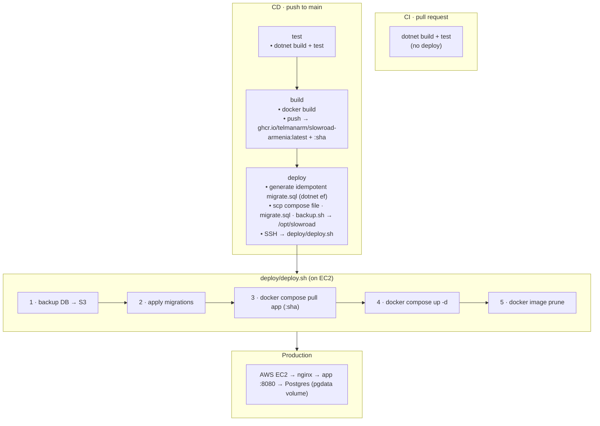

# The Slow Road Armenia

A travel guide to Armenia — built with ASP.NET Core MVC and shipped to AWS EC2
through a fully automated Docker + GitHub Actions pipeline.

### 🌐 Live: [slowroadarmenia.com](https://slowroadarmenia.com/)

---

## Stack

| Layer | Tech |
|---|---|
| App | .NET 9 · ASP.NET Core MVC · EF Core · ASP.NET Identity |
| Data | PostgreSQL 16 · S3 (backups) |
| Ship | Docker Compose · GitHub Actions · GHCR |
| Run | AWS EC2 · nginx |

---

## Pipeline

Two workflows, each stage gating the next:

- **CI** (`ci.yml`) — every pull request to `main`: `dotnet build + test`. No deploy.
- **CD** (`cd.yml`) — every push to `main`: test → build → deploy.

Both can also be run manually from the Actions tab (`workflow_dispatch`).

Deploys use the exact commit SHA image, so any deploy maps to one commit and can
be rolled back. The container binds to `127.0.0.1` only — nothing is exposed
except through nginx.

---

## Docker

Multi-stage build: the SDK image restores and publishes, the slim ASP.NET
runtime image carries only the published output — smaller image, no build tools
in production. The app needs Postgres to run.

---

## Configuration

Secrets are never committed.

**GitHub repo secrets**
`EC2_HOST` · `EC2_USER` · `EC2_SSH_KEY`

**Server `/opt/slowroad/.env`**
`POSTGRES_USER` · `POSTGRES_PASSWORD` · `POSTGRES_DB` ·
`ConnectionStrings__Default` · `Admin__Email` · `Admin__Password` · `BACKUP_BUCKET`

Locally, the connection string lives in `appsettings.Development.json`, and the
admin login (`Admin:Email` / `Admin:Password`) is set via `dotnet user-secrets`.

---

## Database & migrations

On deploy, CD generates an idempotent SQL script and applies it **after** a
backup and **before** the new app starts.

---

## Backups

- **Automatic** before every deploy
- **Manual** runs available on EC2
- Stored gzipped in `s3://$BACKUP_BUCKET/postgres/`; last 2 kept on the server

---

## Rollback

Deploys are pinned to the exact commit SHA image, so an older SHA can be brought
back. Migrations are **not** rolled back — if the schema changed, restore from a
backup.

---

## Branches

| Branch | Role |
|---|---|
| `develop` | Daily work; feature branches merge here |
| `main` | Production; PR from `develop` runs CI, merge deploys automatically |